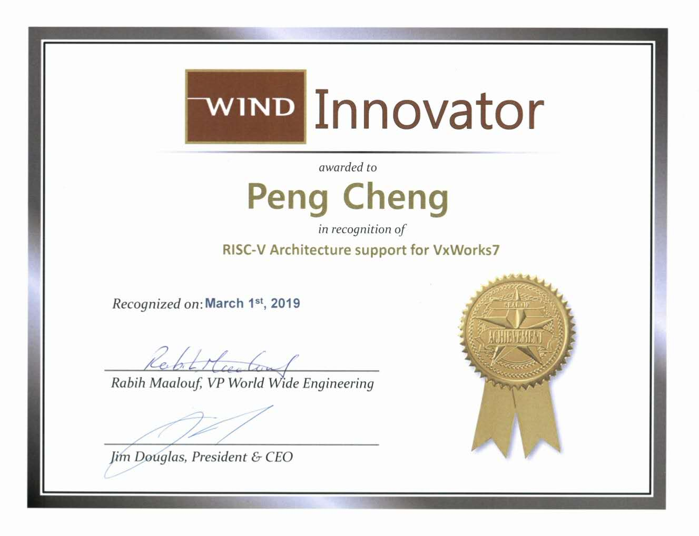
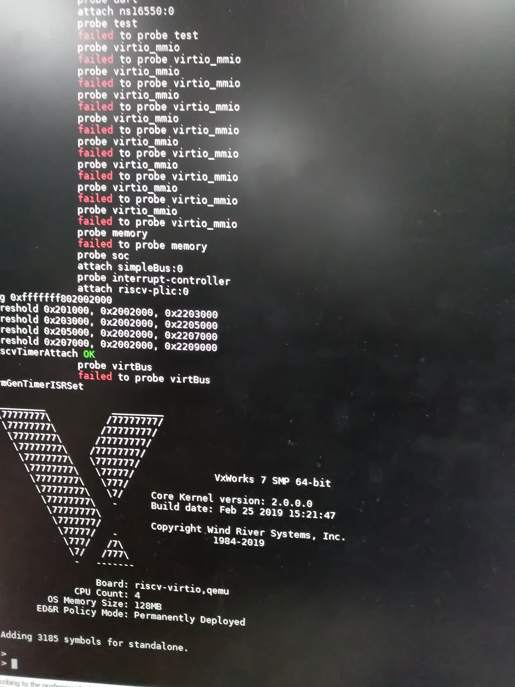

# VxWorks7-RISC-V

Hi,

I wrote these codes just for fun and this add RISC-V arch and Sifive unleashed BSP to VxWorks 7.

But, because of the license issue, codes can not be open-sourced, please contact Wind River if you are interested.

Thanks Wind River who gave me the great platform.

Thanks @Jim-wilson who gave me many help in debugging tools.

BR,
Peng Cheng

