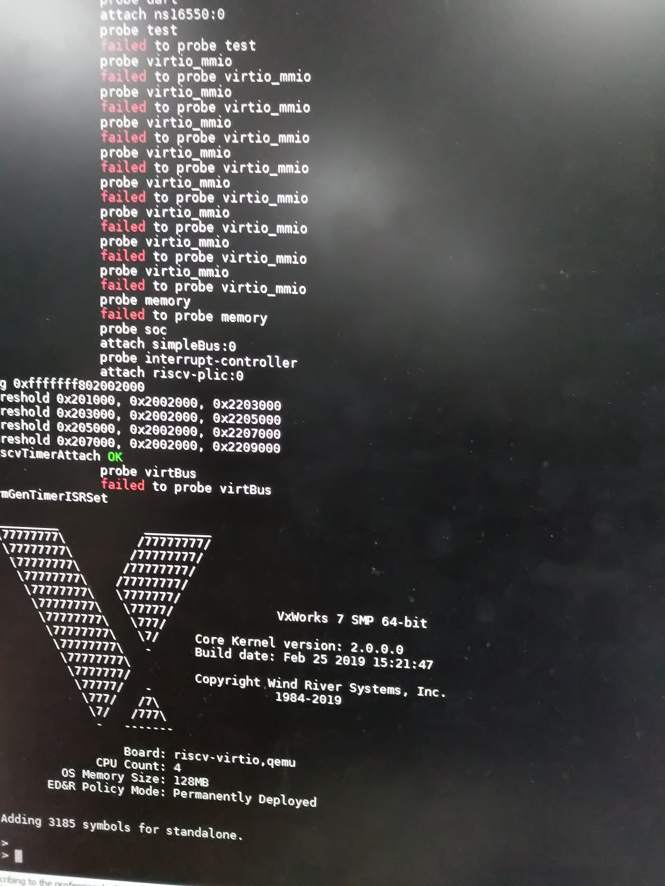

# VxWorks7-RISC-V

Hi all,

I wrote these codes for fun which add RISC-V arch and SIFIVE unleashed BSP to VxWorks 7.

But because the license issue, I need to disccuss with WR IP department to see whether the codes can be opened to public.

(At last, codes can not be open-sourced because of the license issue. - -!)

Thanks @Jim-wilson who gave me many help in debugging tools.

BR,
Peng Cheng

